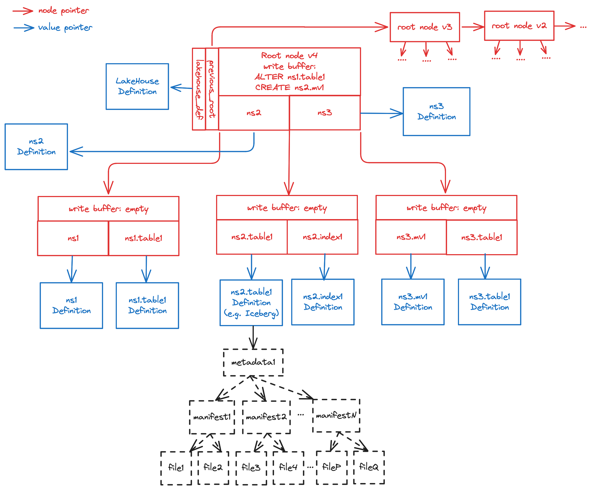

# Overview

!!! note

    The TrinityLake format specification requires specific knowledge about certain data structures, algorithms, 
    database system and file system concepts. If you find anything described difficult to understand, please follow 
    the corresponding links for further explanations, or make a contribution to help us improve this document.

## Version

This document describes the TrinityLake format at version **0.0.0**. 
Please see [Versioning](./versioning.md) about the versioning semantics of this format.

## Introduction

The TrinityLake format defines a Lakehouse-specific [key-value map](tree/search-tree-map.md) 
implemented using a [B-epsilon tree](tree/b-epsilon-tree.md).

- The keys of this map are IDs of objects in a Lakehouse
- The values of this map are location pointers to the **Object Definitions** 

We denote such tree as the **TrinityLake Tree**, 
and denote a Lakehouse implemented using the TrinityLake format as a **Trinity Lakehouse**.

The TrinityLake format contains the following specifications:

- The TrinityLake tree is persisted in storage and follows [Storage Specification](./storage.md).
- The TrinityLake tree is assessed and updated following the [Transaction Specification](./transaction.md).
- The object definitions are persisted in storage and follows the [Object Definition File Specification](./object-definition-file.md).
- The key names in a TrinityLake tree follow the [Key Encoding Specification](./key-encoding.md).
- The locations used in a TrinityLake tree follow the [Location Specification](./location.md).

## Example

Here is an example logical representation of a TrinityLake tree:

This Trinity Lakehouse is a tree of order 3, with the following objects:

- Namespace `ns1`
    - Table `table1`
- Namespace `ns2`
    - Table `table1`: this is an Apache Iceberg table, which further points to its own metadata JSON file,
      manifests Avro files and Parquet/Avro/ORC data files, following the Iceberg table format specification.
    - Index `index1`
- Namespace `ns3`
    - Materialized View `mv1`
    - Table `table1`

There are also a set of write operations that are performed against the objects in the write buffer of the TrinityLake tree:

- Update the definition of existing table `table1` in `ns1`
- Create a new materialized view `mv2` in namespace `ns2`

The root tree node is at version 4, and also points to the previous version of the root node of the Lakehouse.
This is used for achieving time travel, rollback and snapshot export.
