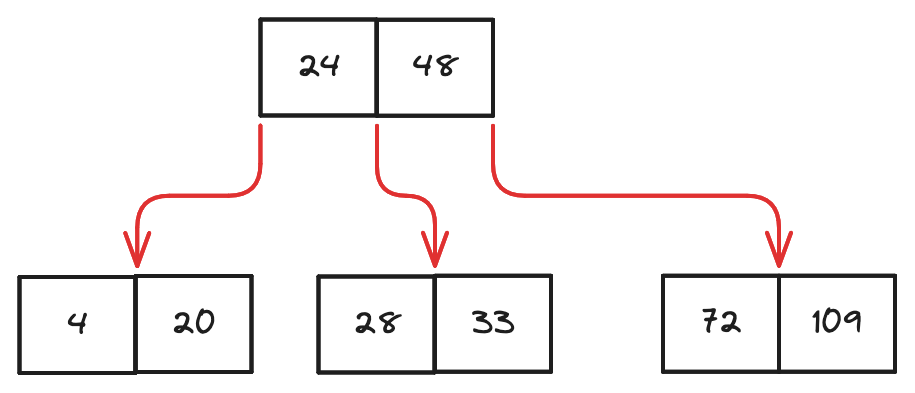
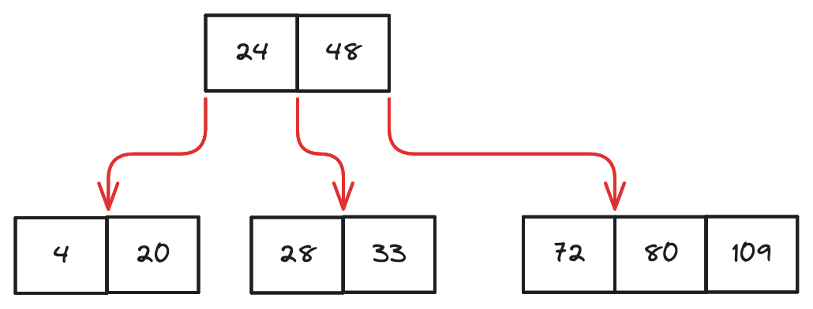
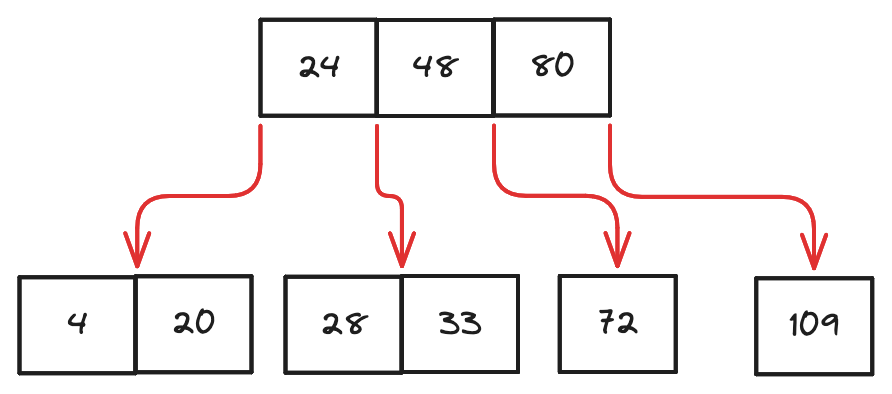
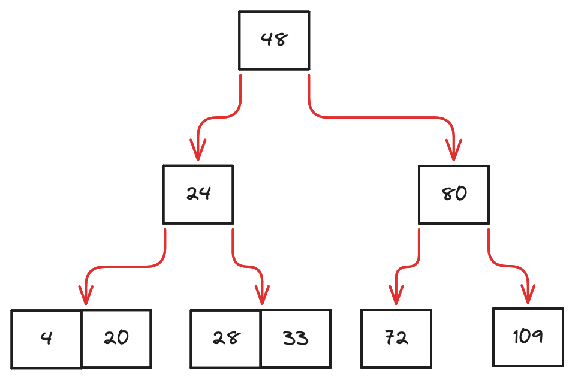

# B-Tree

A N-way search tree only enforces the general requirements for the number of children per tree node.
The tree could become imbalanced over time. A B-tree is of order N a self-balancing N-way search tree
that enforces a set of rules when manipulating the tree:

1. All leaf nodes must appear at the same level
2. The root node must have at least 2 children, unless it is also a leaf
3. All nodes, except for the root node and leaves, must have at least `⌈N/2⌉` children

## Example

There are many tutorials online talking about B-Tree.
We will not describe all details here, but here is an example:

Consider putting a new key `80` to the tree, it would undergo the following steps:

### Step 1: Put to leaf

### Step 2: Split 1

### Step 3: Split 2

