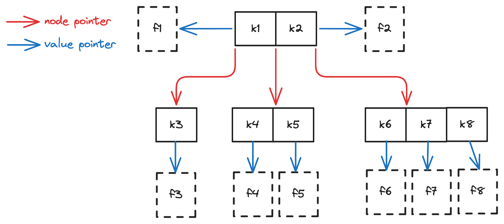

# Search Tree Map

A [search tree](./search-tree.md) can not only be used as the implementation of a set, but also a key-value **Map**.
For database system applications of search trees like TrinityLake,
the pointer is typically stored as the value in map, which points to a much larger payload in memory.

In this setup, each tree node not only contains keys,
but also **Value Pointer**s which points to the **Value** for each key.
Consider a key-value map, where the value for a key is a file,
then a 3-way search tree could look like the following:

## Storage Layout

A N-way search tree map can be persisted in storage.
Here we introduce one way to store it that is used in TrinityLake.
We will store each node of the search tree as a tabular file, that we call **Node Files**.

For example, using this mechanism, the previous 3-way search tree could look like the following 4 files in S3:

