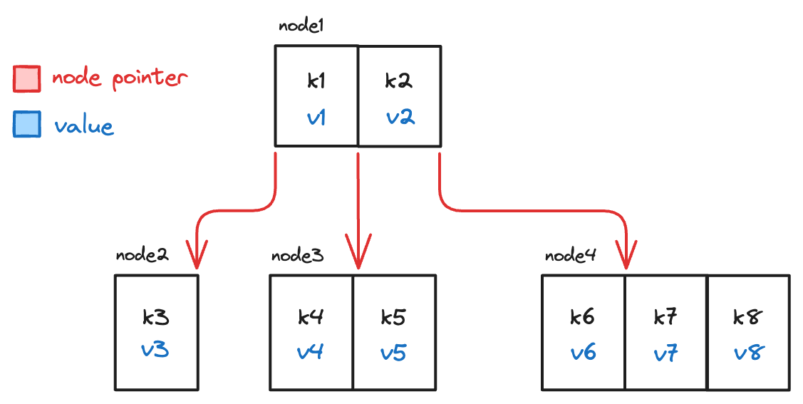
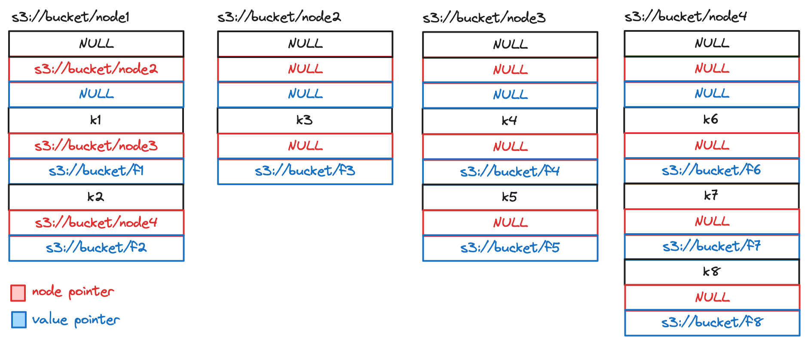

# Search Tree Map

A [search tree](./search-tree.md) can not only be used as the implementation of a set, but also a key-value **Map**.
This can be easily achieved by storing the value together with its corresponding key. 
Here is a visual example 4-way search tree map:

## Node Key Table

For each node of the search tree map, there is an internal mapping of key to value and child node pointers.
A **Node Key Table** provides a way to describe such information in a tabular fashion.

Every key, value and node pointer tuple forms a row in this node key table.
There are exactly `N` rows for each node in a `N`-way search tree.
The construction of the table follows the rules below:

1. The first row must have `NULL` key and `NULL` value, and the node pointer (if exists) points to the leftest child node.
2. Subsequent rows must be filled with non-null key and value from left to right. 
    The node pointer at the row (if exists) points to the right child node of the key at the same row.
3. If there are less than `N-1` keys available to form `N` rows, the remaining rows are filled with all `NULL` values for key, 
    value and node pointer.

For example, the node map of node 1 in the example above would look like:

| Key  | Value | Node Pointer      |
|------|-------|-------------------|
| NULL | NULL  | /address/to/node2 |
| k1   | v1    | /address/to/node3 |
| k2   | v2    | /address/to/node4 |
| NULL | NULL  | NULL              |

## Search Tree Map with Value as Pointers

For TrinityLake, it is common for the values in map to be pointers / addresses / locations 
that points to a much larger payload in memory or on disk.

Consider a key-value map, where the value for a key is a file,
then a 4-way search tree map could look like the following:

The same node 1 would have the following node key table:

| Key  | Value          | Node Pointer      |
|------|----------------|-------------------|
| NULL | NULL           | /address/to/node2 |
| k1   | /address/to/f1 | /address/to/node3 |
| k2   | /address/to/f2 | /address/to/node4 |
| NULL | NULL           | NULL              |

## Node File

To persist the whole tree in storage, each node key table is stored as a separated file that we call a **Node File**.
For example, using this mechanism, the 4-way search tree above could look like the following 4 node files in S3:

