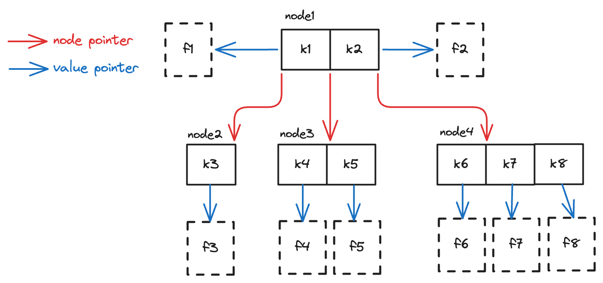
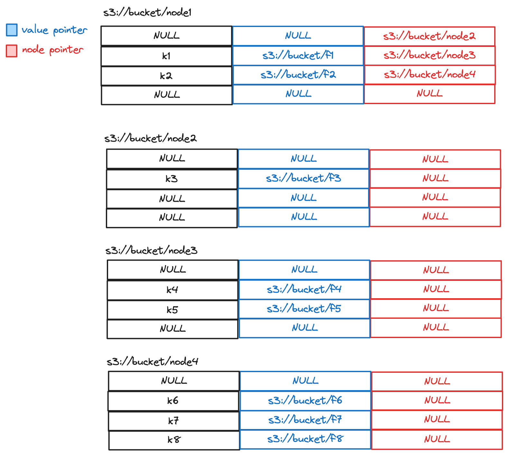

# Search Tree Map

In TinityLake, the N-way search tree is not used as a key-value store.
This means that each tree node not only contains keys,
but also **Value Pointer**s which points to the **Value** for each key.

Consider a key-value storage, where the value for a key is a file in a storage system,
then a 3-way search tree could look like the following:

## Operations

The search tree exposes the following possible operations:

- Read Operations:
    - GetKey
    - ScanKeys
- Write Operations:
    - PutKey
    - BatchPutKeys
    - DeleteKey
    - BatchDeleteKeys
    - BatchPutOrDeleteKeys

## Storage Layout

A N-way search tree can be persisted in storage.
Here we introduce one way to store it that is used in TrinityLake.
We will store each node of the search tree as a tabular file, that we call **Node Files**, with the following shape:

For example, using this mechanism, the previous 3-way search tree could look like the following 4 files in S3:

