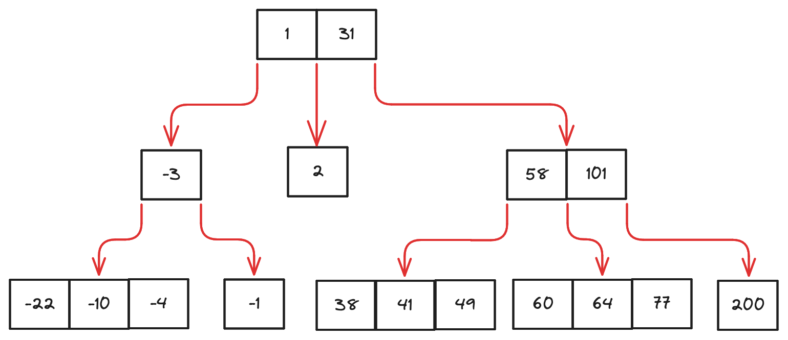

# Search Tree

A search tree is a tree data structure used for locating specific **Key**s from within a set.
A search tree consists of a set of **Node**s, and each node has a set of keys.
For example, consider a search tree with integer keys:

To search for key `64`:

1. start from the top node `(1, 31)`, `64` is greater than `31` so go right
2. in `(58, 101)`, `64` is greater than `58` but smaller than `101`, so go down the pointer between `58` and `101`
3. in `(60, 64, 77)`, we find exact value for `64`
4. conclusion: key `64` is contained within the set

## N-Way Search Tree

A N-way search tree is a search tree where:

1. A node with `k` children must have `k-1` number of keys.
2. Each node must have a maximum of `N` child nodes (i.e. each node must have a maximum of `N-1` keys)

The example above thus satisfies the requirement of being a 4-way search tree.
