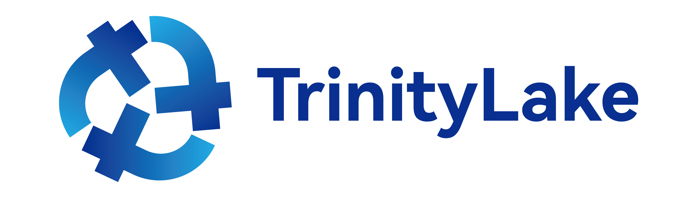

# Welcome to TrinityLake

## Introduction

TrinityLake is an **Open Lakehouse Format** for Big Data Analytics, ML & AI. 
It defines the objects in a Lakehouse and provides a consistent and efficient way for accessing and manipulating these objects.
The TrinityLake format offers the following key features:

### Multi-Object Multi-Statement Transactions

TrinityLake enables multi-object multi-statement transactions across different tables, indexes, views, 
materialized views, etc. within a Lakehouse.
Users could start to leverage standard SQL BEGIN and COMMIT semantics and expect ACID enforcement 
at SNAPSHOT or SERIALIZABLE isolation level across the entire Lakehouse.

### Consistent Time Travel, Rollback and Snapshot Export

TrinityLake provides a single timeline for all the transactions that have taken place within a Lakehouse.
Users can perform time travel to get a consistent view of all the objects in the Lakehouse,
rollback the Lakehouse to a consistent previous state,
or choose to export a snapshot of the entire Lakehouse at any given point of time.

### Storage Only

TrinityLake mainly leverages one storage primitive - mutual exclusion of file creation.
This means you can run TrinityLake on almost any storage solution including Linux file system, 
open source storage solutions like Apache Hadoop Distributed File System (HDFS) or Apache Ozone, 
and cloud storage providers like Amazon S3, Google Cloud Storage, Azure Data Lake Storage. 
You can build a truly open Lakehouse with TrinityLake without the need to pick a 
Catalog / DataLake / Lakehouse / Warehouse vendor and worry about potential vendor lock-in risks.

## Compatibility

### Open Table Formats

TrinityLake can work with popular open table formats such as Apache Iceberg.
Users can create and use these tables with both the traditional SQL `MANAGED` or `EXTERNAL` experience,
as well as through federation when the table resides in other systems that can be connected to for read and write.

### Open Catalog Standards

TrinityLake can be used as an implementation of open catalog standards like the Apache Iceberg REST Catalog (IRC) specification.
The project provides an IRC server that users can run as a proxy to access TrinityLake and leverage all open source and 
vendor products that support IRC. This provides a highly scalable yet extremely lightweight IRC implementation 
where the IRC server is mainly just an authorization engine, and the main execution logic is pushed down to the storage
layer and handled by this open Lakehouse format.

### Open Engines

Through open table formats and open catalog standards, you can use TrinityLake with any open engine that supports them.
In addition, TrinityLake is developing native connectors to various open engines such as Apache Spark.
These native connectors will provide the full TrinityLake experience to users.

## Sidenote: why the name TrinityLake?

Trinity Lake, previously called Clair Engle Lake, is a beautiful reservoir on the Trinity River formed by 
the Trinity Dam and located in Trinity County, California, USA.
Since we are building a format for Lakehouse, we decided to pick a name of a lake we like.

We also like the term _trinity_ as we see it symbolizes the 2 goals of this project:

1. make catalog, table format, file format operate as one unified format on storage.
2. run analytics, ML & AI workloads all on the same Lakehouse platform.
